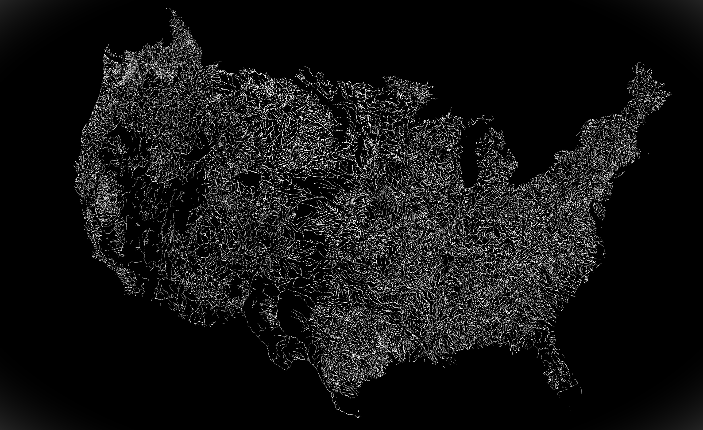

## Motivation:

Over the past several months, I have been working with data from the US Geological Survey's (USGS) National Hydrologic Model (NHM), a valuable resource that required some time to become familiar with. The goal of this post is to provide an overview of the NHM, incorporating as many links as possible, with the hope of encouraging others to utilize these resources and serving as a springboard for further investigation.

### Why should you care about the NHM? 

Water systems modelers are consistently in need of data. You might find that the specific streamflow data you seek does not exist, or perhaps you have some data but want to expand your training set. You may also wish to broaden your data to include not only streamflow but also estimates of various geophysical, hydrological, or environmental variables such as catchment area, vegetation classifications, and evapotranspiration.

The NHM can quench your data thirst by offering Continental US (CONUS) scale estimates of different geo-hydro-climatic variables synthesized from multiple datasets.

You can access these NHM datasets (simulated streamflow, land-cover parameter values, etc.) yourself through the [ScienceBase website.](https://www.sciencebase.gov/catalog/item/4f4e4773e4b07f02db47e234) However, it is first beneficial to understand the various components of the NHM infrastructure more broadly.

*******
## Introduction

The [National Hydrologic Model (NHM) infrastructure](https://www.usgs.gov/mission-areas/water-resources/science/national-hydrologic-model-infrastructure) is designed with the goal... 

>*"... to facilitate hydrologic model parameterization on the basis of datasets that characterize geology, soil, vegetation, contributing area, topography, growing season, snow dynamics, climate, solar radiation, and evapotranspiration across the CONUS."*

The NHM includes several different components
1. The Geospatial Fabric
2. Model input datasets
3. Physical models used to simulate hydrologic processes 

In this post, I will delve into each of these components, providing more information, and conclude by pointing out ways you can access the model outputs yourself.
### The Geospatial Fabric
The [geospatial fabric](https://wwwbrr.cr.usgs.gov/projects/SW_MoWS/GeospatialFabric.html) contains spatial data that serves as the skeletal structure of the NHM, facilitating the routing of modeled streamflow across across catchments.  The image below shows the CONUS-scale geospatial fabric. 



The geospatial fabric contains individual stream reaches (called "segments"), delineated sub-catchments (called "Hydrologic Response Units", or HRUs), and many specific points of interest which correspond to USGS observational gauge locations. 

The raw data for version 1.1 of the Geospatial Fabric can be found [here.](https://www.sciencebase.gov/catalog/item/5e29b87fe4b0a79317cf7df5)

The spatial data is largely drawn from the [National Hydrography Dataset (NHD)](https://www.usgs.gov/national-hydrography/national-hydrography-dataset) which defines the high-resolution stream linkages and provides a unique identifier (called "ComID") for each stream segment. 

If you are looking to set up a workflow which uses NHM streamflow data, you will need to specify the ComID numbers for your locations of interest. You can then retrieve the data for each ComID location. 

If you are doing this with Python, then I suggest you check out [PyNHD package](https://hyriver.readthedocs.io/en/latest/readme/pynhd.html) which [I previously highlighted on this blog](https://waterprogramming.wordpress.com/2022/09/20/efficient-hydroclimatic-data-accessing-with-hyriver-for-python/), and which can identify NHD ComID numbers based on coordinate points. 

For more information on the geospatial fabric, you can see Bock et al. (2020). 

### PRMS

The [Precipitation-Runoff Modeling System (PRMS)](https://www.usgs.gov/software/precipitation-runoff-modeling-system-prms) is described by the USGS as being:

>*"a deterministic, distributed-parameter, physical process based modeling system developed to evaluate the response of various combinations of climate and land use on streamflow and general watershed hydrology."*

The PRMS simulates many different hydrologic processes such as snowmelt, infiltration, groundwater recharge, surface runoff, and finally streamflow. A conceptual representation of the PRMS, taken from Markstrom et al. (2015) shows the modeled relationships between these processes: 


The input data for the PRMS is flexible, but requires some combination of precipitation, air temperature, and solar radiation timeseries.  Historic [Daymet](https://doi.org/10.3334/ORNLDAAC/1328) data provide the climate forcings for the historic period, but future climate projections can also be used.

Additionally, the model requires a set of catchment-delineated parameter values which quantify things such as soil types, types of vegetation coverage, percentage of impervious surfaces, etc.  These data can be provided by the [National Land Cover Database (NLCD),](https://www.usgs.gov/centers/eros/science/national-land-cover-database#science) or alternative land cover change scenarios can be used to assess the impact of land surface on hydrology.

The PRMS is thus able to provide a strong physical processes basis when coupled with the NHM.  The combination of these two models is simply referred to as the NHM-PRMS. 

You can access the [user manual for the PRMS here](https://pubs.usgs.gov/publication/wri834238), and a [report describing the latest version (PRMS-IV) from Markstrom et al (2015) here.](https://pubs.usgs.gov/tm/6b7/pdf/tm6-b7.pdf)

## Accessing NHM datasets

The NHM infrastructure is great in the sense that it is flexible and incorporates so many different datasets.  However, this may introduce difficulty in running the models yourself (I have not attempted this, and don't have guidance on that).

Fortunately, there are some datasets which have been shared by the USGS, and which conveniently provide various model outputs or calibrated parameters without the need to interact with the model directly. 

You can access and explore available datasets from the [NHM through the ScienceBase website](https://www.sciencebase.gov/catalog/item/4f4e4773e4b07f02db47e234).

A few notable datasets that you might be interest in using are:
- [Modeled streamflow values for the calibrated NHM-PRMS for the period 1983-2016 for CONUS](https://www.sciencebase.gov/catalog/item/5d826f6ae4b0c4f70d05913f)
- [Geospatial Fabric GIS features](https://www.sciencebase.gov/catalog/item/535eda80e4b08e65d60fc834)
- [Parameter values for the PRMS](https://www.sciencebase.gov/catalog/item/58b9ce9be4b0bcef64ef8164)

### NHM-PRMS simulated streamflow from 1980-2016

Here I want to highlight one of these datasets that I have the most experience working with, and which I believe may be the most interesting to the WaterProgramming crowd: the "*Application of the National Hydrologic Model Infrastructure with the Precipitation-Runoff Modeling System (NHM-PRMS), 1980-2016, Daymet Version 3 calibration*".

This dataset contains daily streamflow values across CONUS for the period from 1980-2016, at each HRU and segment contained in the geospatial fabric, and is available through the link [here](https://www.sciencebase.gov/catalog/item/5d826f6ae4b0c4f70d05913f). 

**Note:** Given the scale of this dataset, the file is rather large (92 GB).

Here I want to show how easy in can be to access the streamflow timeseries from this dataset. Assuming that you have downloaded full NHM-PRMS dataset file, for the fully observed-calibrated and Muskingum routing simulation (`byHRU_musk_obs.tar`), you can extract the segment streamflow timeseries using just a few lines of Python code: 

```python
## Example of how to extract streamflow data from NHM-PRMS
import tarfile
import netCDF4 as nc
import pandas as pd

# Open file and extract just segment outflow
tar = tarfile.open('your_data_directory/byHRU_musk_obs.tar')
tar.extract('seg_outflow', path= './extracted/')

# Open the extracted netCDF
segment_outflow = nc.Dataset(f'./extracted/seg_outflow.nc')

# Store values and segment IDs
vals = segment_outflow['seg_outflow'][:]
segment_ids = segment_outflow['segment'][:]

# Make a dataframe
segment_outflow_df = pd.DataFrame(vals, columns = segment_ids)
```

At this point, `segment_outflow_df` will contain data from all of CONUS, and you will likely want to choose a subset of this data using the ComID numbers for each segment; I'll have to leave that part up to you!

I hope this post helped to shine some light on this great resource, and encourages you to consider leveraging the NHM in your own work.  As always, thanks for reading!

## References

1. Bock, A.E, Santiago,M., Wieczorek, M.E., Foks, S.S., Norton, P.A., and Lombard, M.A., 2020, Geospatial Fabric for National Hydrologic Modeling, version 1.1 (ver. 3.0, November 2021): U.S. Geological Survey data release, https://doi.org/10.5066/P971JAGF.
2. Regan, R.S., Markstrom, S.L., Hay, L.E., Viger, R.J., Norton, P.A., Driscoll, J.M., LaFontaine, J.H., 2018, Description of the National Hydrologic Model for use with the Precipitation-Runoff Modeling System (PRMS): U.S. Geological Survey Techniques and Methods, book 6, chap B9, 38 p., https://doi.org/10.3133/tm6B9.
3. Leavesley, G. H. (1984). _Precipitation-runoff modeling system: User's manual_ (Vol. 83, No. 4238). US Department of the Interior.
4. Markstrom, S. L., Regan, R. S., Hay, L. E., Viger, R. J., Webb, R. M., Payn, R. A., & LaFontaine, J. H. (2015). PRMS-IV, the precipitation-runoff modeling system, version 4. _US Geological Survey Techniques and Methods_, _6_, B7.
5. Hay, L.E., and LaFontaine, J.H., 2020, Application of the National Hydrologic Model Infrastructure with the Precipitation-Runoff Modeling System (NHM-PRMS),1980-2016, Daymet Version 3 calibration: U.S. Geological Survey data release, https://doi.org/10.5066/P9PGZE0S.

