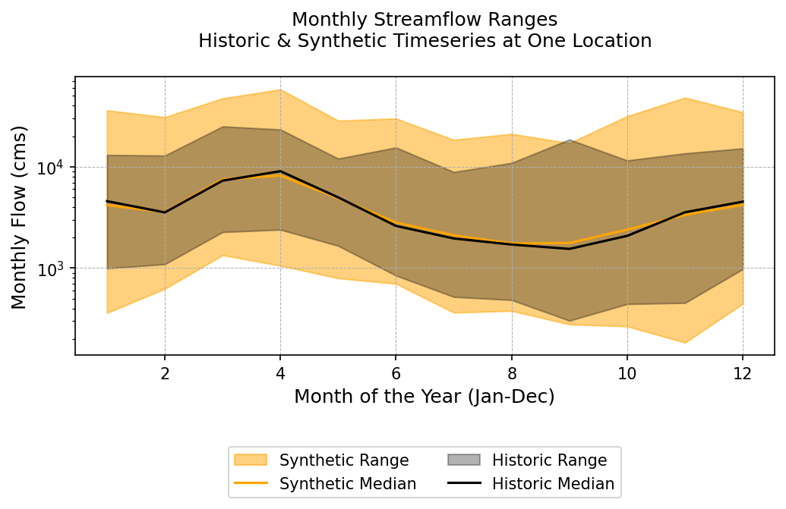
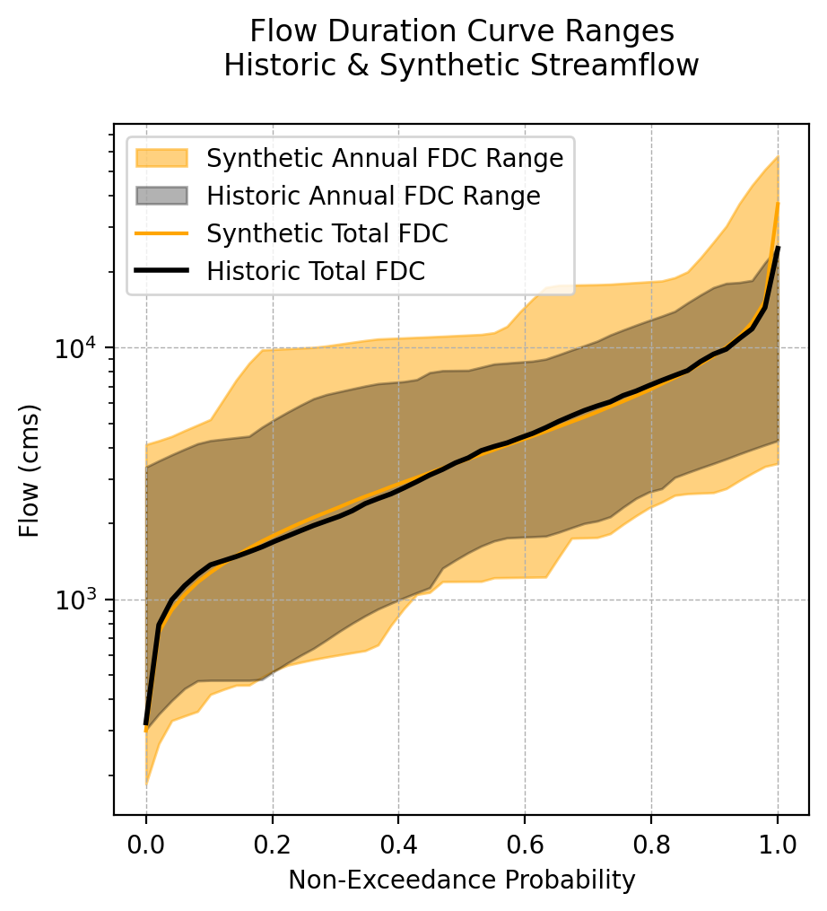

In 1962 a group of economists, engineers and political scientists who were involved in the Harvard Water Program published "*Design of Water Resource Systems*". In chapter 12 of the book, Thomas and Fiering present the following statistical model which was one of the first, if not the first, formal application of stochastic modelling for synthetic streamflow generation and water resource systems evaluation.

It is an autoregressive model which can simulate monthly streamflow values based on the mean, variance, and correlation of historic observations. 

In this blog post, I present the model in it's original form along with a modified form presented by Stedinger and Taylor (1982). Then, I share a Python implementation of the model which is used to generate an ensemble of synthetic flows.  I use plotting tools from the [Synthetic Generation Figure Library](https://waterprogramming.wordpress.com/2023/05/24/figure-library-part-2-visualizations-supporting-synthetic-streamflow-diagnostics/) to plot the results. 

All of the code used for this post is available on my github here: [ThomasFieringModelDemo](https://github.com/TrevorJA/ThomasFieringModelDemo/tree/main)

Let's get into it!

## The Thomas-Fiering Model

The model that Thomas and Fiering proposed took the form:

$$Q_{m+1} = \bar{Q}_{m+1} + b_m(Q_m-\bar{Q}_m)+\epsilon\sigma_{m+1}(1-r_{m}^2)^{1/2}$$


Where, for each month $m$, $Q_m$ is the generated flow, $\bar{Q}_m$ is the mean historic flow, $b_m$ is an autoregression coefficient for predicting that months flow from the prior months flow, $\sigma$ is the standard deviation, $r$ is the correlation coefficient and  $\epsilon$ is a random standard normal variable. 

A modification to this model was proposed by Stedinger and Taylor (1982), which transforms transforms the streamflow values before fitting the model. I refer to this as the "Stedinger transformation" below and in the code. 

Given $Q_{m}$ as the observed flows in month $m$, the Stedinger transformation of the observed flows is then:

$$x_{m} = ln(Q_{m} - \hat{\tau}_m)$$ 

where $\hat{\tau}_m$ is the estimated "lower bound" for each month, calculated as:

$$\hat{\tau}_m = \frac{Q_{m, max}Q_{m, min} - Q_{m, median}^2}{Q_{m, max}+ Q_{m, min} - 2Q_{m, median}}$$

The modeled flows are generated from the recursive relationship:

$$x_{m+1} = \mu_m + \rho_m \left(\frac{\sigma_{m+1}}{\sigma_{m}}\right) \left(x_{m} - \mu_{m}\right) + \sigma_{m+1} \epsilon_{m+1} (1 - \rho_{m}^2)^{1/2}$$


Where:
- $\mu_{m}$ is the observed average historic monthly $x$ series
- $\sigma_{m}^2$ is the observed variance of the historic monthly $x$ series
- $\epsilon_{m}$ independent standard-normal random variables
- $\rho_m$ observed between-month correlations of the historic $x$ series

The above steps are performed for each month, and the synthetic streamflow sequence is generated by iteratively applying the stochastic process for the desired duration.

## Python Implementation

I built this version of the Thomas Fiering model as a Python class with the following structure:
```python
class ThomasFieringGenerator():
    def __init__(self, Q, **kwargs):
        
    def preprocessing(self, **kwargs):
	    # Stedinger normalization
	    
    def fit(self, **kwargs):
	    # Calculate mu, sigma, and rho for each month
	    
    def generate(self, n_years, **kwargs):
	    # Iteratively generate a single timeseries
	    # Inverse stedinger normalization
        return Q_synthetic
    
    def generate_ensemble(self, n_years, 
                          n_realizations = 1, 
                          **kwargs):
        # Loop and generate multiple timeseries
        return 
```

Rather than posting the entire code here, which would clutter the page, I will refer you to and encourage you to check out the full implementation which is in the linked repository here: [ThomasFieringModelDemo/model.py](https://github.com/TrevorJA/ThomasFieringModelDemo/blob/main/model.py)

To see how this is used and replicate the results below using some example data, see the Jupyter Notebook: [ThomasFieringModelDemo/ThomasFiering_demo.ipynb](https://github.com/TrevorJA/ThomasFieringModelDemo/blob/main/ThomasFiering_demo.ipynb "ThomasFiering_demo.ipynb")

### Synthetic ensemble results
I used the `ThomasFieringGenerator` to produce 100 samples of 50-year monthly streamflows at [USGS gauge site 01434000 on the Delaware River](https://waterdata.usgs.gov/monitoring-location/01434000/#parameterCode=00065&period=P7D&showMedian=false) which has data going back to 1904.

This data is available in the repo and is stored in the file [usgs_monthly_streamflow_cms.csv](https://github.com/TrevorJA/ThomasFieringModelDemo/blob/main/usgs_monthly_streamflow_cms.csv)

The [plotting functions](https://github.com/TrevorJA/ThomasFieringModelDemo/blob/main/plotting.py) are taken from the [Synthetic Generation Figure Library](https://waterprogramming.wordpress.com/2023/05/24/figure-library-part-2-visualizations-supporting-synthetic-streamflow-diagnostics/) which was shared previously on the blog. 

First we consider the range of historic and synthetic streamflow timeseries:

<div style="text-align: center;">
    
</div>


Generally when working with synthetic ensembles it is good for the distribution of synthetic ensembles "envelope" the historic range while maintaining a similar median. The Thomas Fiering model does a good job at this!

The next figure shows the range of flow-quantile values for both historic and synthetic flows. Again, we see a nice overlapping of the synthetic ensemble:

<div style="text-align: center;">
    
</div>


## Conclusions
I personally think it is fun and helpful to look back at the foundational work in a field. Since Thomas and Fiering's work in the early 1960s, there has been a significant amount of work focused on synthetic hydrology. 

The Thomas Fiering model has a nice simplicity while still performing very nicely (with the help of the Stedinger normalization). Sure there are some limitations to the model (e.g., the estimation of distribution and correlation parameters may be inaccurate for short records, and the method does not explicitly prevent the generation of negative streamflows), but the model, and the Harvard Water Program more broadly, was successful in ushering in new approaches for water resource systems analysis. 