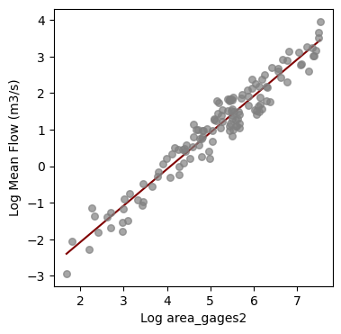
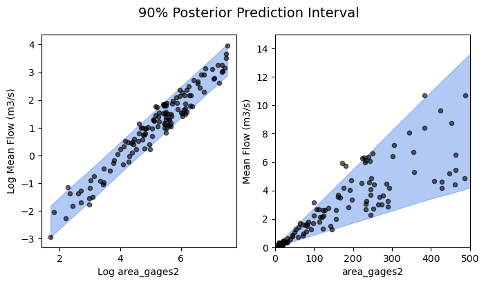

## Motivation
Fans of this blog will know that uncertainty is often a focus for our group. When approaching uncertainty, Bayesian methods might be of interest since they explicitly provide uncertainty estimates during the modeling process.  

[PyMC](https://www.pymc.io/welcome.html) is the best tool I have come across for Bayesian modeling in Python; this post gives a super brief introduction to this toolkit.
## Introduction to PyMC

PyMC, described in their own words:
"... is a probabilistic programming library for Python that allows users to build Bayesian models with a simple Python API and fit them using Markov chain Monte Carlo (MCMC) methods."

In my opinion, the best part of PyMC is the flexibility and breadth of model design features. The space of different model configurations is massive. It allows you to make models ranging from simple linear regressions (shown here), to more complex hierarchical models, [copulas](https://en.wikipedia.org/wiki/Copula_(probability_theory), [gaussian processes](https://en.wikipedia.org/wiki/Gaussian_process), and more. 

Regardless of your model formulation, PyMC let's you generate posterior estimates of model parameter distributions. These parameter distributions reflect the uncertainty in the model, and can propagate uncertainty into your final predictions. 

The posterior estimates of model parameters are generated using [Markov chain Monte Carlo (MCMC) methods.](https://en.wikipedia.org/wiki/Markov_chain_Monte_Carlo) A detailed overview of MCMC is outside the scope of this post (maybe in a later post...). 

In the simplest terms, MCMC is a method for estimating posterior parameter distributions for a Bayesian model. It generates a sequence of samples from the parameter space (which can be huge and complex), where the probability of each sample is proportional to its likelihood given the observed data. By collecting enough samples, MCMC generates an approximation of the posterior distribution, providing insights into the probable values of the model parameters along with their uncertainties. This is key when the models are very complex and the posterior cannot be directly defined. 

The [PyMC example gallery has lots of cool stuff](https://www.pymc.io/projects/examples/en/latest/gallery.html) to get you inspired, with examples that go far and beyond the simple linear regression case. 

***
## Demonstration: 
When writing drafting this post, I wanted to include a demonstration which is (a) simple enough to cover in a brief post, and (b) relatively easy for others to replicate.  I settled on the simple linear regression model described below, since this was able to be done using readily retrievable CAMELS data. 

The example attempts to predict mean streamflow as a linear function of basin catchment area (both in log space).  As you'll see, it's not the worst model, but its far from a *good model*; there is a lot of uncertainty!  
### CAMELS Data
For a description of the [CAMELS](https://ral.ucar.edu/solutions/products/camels) dataset, see Addor, Newman, Mizukami and Clark (2017).

I pulled all of the national CAMELS data using the `pygeohydro` package from [HyRiver](https://docs.hyriver.io/index.html) which I have previously recommended on this blog. This is a convenient single-line code to get all the data:  

```python
import pygeohydro as gh

### Load camels data
camels_basins, camels_qobs = gh.get_camels()
```

The `camels_basins` variable is a dataframe with the different catchment attributes, and the `camels_qobs` is a xarray.Dataset.  In this case we will only be using the `camels_basins` data.  

The CAMELS data spans the continental US, but I want to focus on a specific region (since hydrologic patterns will be regional).  Before going further, I filter the data to keep only sites in the Northeaster US:

```python
# filter by mean long lat of geometry: NE US
camels_basins['mean_long'] = camels_basins.geometry.centroid.x
camels_basins['mean_lat'] = camels_basins.geometry.centroid.y
camels_basins = camels_basins[(camels_basins['mean_long'] > -80) & (camels_basins['mean_long'] < -70)]
camels_basins = camels_basins[(camels_basins['mean_lat'] > 35) & (camels_basins['mean_lat'] < 45)]
```

I also convert the mean flow data (`q_mean`) units from mm/day to cubic meters per day:
```python
# convert q_mean from mm/day to m3/s
camels_basins['q_mean_cms'] = camels_basins['q_mean'] * (1e-3) *(camels_basins['area_gages2']*1000**2) * (1/(60*60*24)) 

```

And this is all the data we need for this crude model!
### Bayesian linear model

The simple linear regression model (hello my old friend):
$$y = \alpha + \beta X + \epsilon$$
Normally you might assume that there is a single, best value corresponding to each of the model parameters (alpha and beta). This is considered a [Frequentist](https://en.wikipedia.org/wiki/Frequentist_probability) perspective and is a common approach.  In these cases, the best parameters can be estimated by minimizing the errors corresponding to a particular set of parameters ([see least squares, for example](https://en.wikipedia.org/wiki/Least_squares).

However, we could take a different approach and **assume that the parameters (intercept and slope) are random variables themselves, and have some corresponding distribution.**  This would constitute a Bayesian perspective.  

Keeping with simplicity in this example, I will assume that the intercept and slope each come from a normal distribution with a mean and variance such that:
$$\alpha \sim \mathcal{N}(\mu_{\alpha}, \sigma_{\alpha}^2)$$
$$\beta \sim \mathcal{N}(\mu_{\beta}, \sigma_{\beta}^2)$$
When it comes time to make inferences or predictions using our model, we can create a large number of predictions by sampling different parameter values from these distributions.  Consequently, we will end up with a distribution of uncertain predictions. 

### PyMC implementation

I recommend you see the [PyMC installation guide to help you get set up.](https://www.pymc.io/projects/docs/en/latest/installation.html#installation)

NOTE: The MCMC sampler used by PyMC is written in C and will be SIGNIFICANTLY faster if you provide have access to GCC compiler and specify the it's directory using the the following:

```python
import pymc as pm

import os
os.environ["THEANO_FLAGS"] = "gcc__cxxflags=-C:\mingw-w64\mingw64\bin"
```

You will get a warning if you don't have this properly set up.  

Now, onto the demo!

I start by retrieving our X and Y data from the CAMELS dataset we created above:
```python
# Pull out X and Y of interest
x_ftr= 'area_gages2'
y_ftr = 'q_mean_cms'
xs = camels_basins[x_ftr] 
ys = camels_basins[y_ftr]

# Take log-transform 
xs = np.log(xs)
ys = np.log(ys)
```

At a glance, we see there is a reasonable linear relationship when working in the log space:

<div style="text-align: center;">
    
</div>

Two of the key features when building a model are:
- The random variable distribution constructions
- The deterministic model formulation

There are lots of [different distributions available](https://www.pymc.io/projects/docs/en/latest/api/distributions.html), and each one simply takes a name and set of parameter values as inputs.  For example, the normal distribution defining our intercept parameter is:

```python
alpha = pm.Normal('alpha', mu=intercept_prior, sigma=10)
```

The value of the parameter priors that you specify when construction the model may have a big impact depending on the complexity of your model.  For simple models you may get away with having uninformative priors (e.g., setting `mu=0`), however if you have some initial guesses then that can help with getting reliable convergence.  

In this case, I used a simple least squares estimate of the linear regression as the parameter priors:

```python
slope_prior, intercept_prior = np.polyfit(xs.values.flatten(), ys.values.flatten(), 1)
```

Once we have our random variables defined, then we will need to formulate the deterministic element of our model prediction.  This is the functional relationship between the input, parameters, and output.  For our linear regression model, this is simply:

```python
y_mu = alpha + beta * xs
```

In the case of our Bayesian regression, this can be thought of as the mean of the regression outputs.  The final estimates are going to be distributed around the `y_mu` with the uncertainty resulting from the combinations of our different random variables. 

```python
### PyMC linear model
with pm.Model() as model:
    
    # Priors
    alpha = pm.Normal('alpha', mu=intercept_prior, sigma=10)
    beta = pm.Normal('beta', mu=slope_prior, sigma=10)
    sigma = pm.HalfNormal('sigma', sigma=1)

    # mean/expected value of the model
    mu = alpha + beta * xs

    # likelihood
    y = pm.Normal('y', mu=mu, sigma=sigma, observed=ys)

    # sample from the posterior
    trace = pm.sample(2000, cores=6)
    
```

With our model constructed, we can use the `pm.sample()` function to begin the MCMC sampling process and estimate the posterior distribution of model parameters.  Note that this process can be very computationally intensive for complex models! (Definitely make sure you have the GCC set up correctly if you plan on needing to sample complex models.)

Using the sampled parameter values, we can create posterior estimates of the predictions (log mean flow) using the posterior parameter distributions:
```python
## Generate posterior predictive samples
ppc = pm.sample_posterior_predictive(trace, model=model)
```

Let's go ahead and plot the range of the posterior distribution, to visualize the uncertainty in the model estimates:

```python
### Plot the posterior predictive interval
fig, ax = plt.subplots(ncols=2, figsize=(8,4))

# log space
az.plot_hdi(xs, ppc['posterior_predictive']['y'], 
            color='cornflowerblue', ax=ax[0], hdi_prob=0.9)
ax[0].scatter(xs, ys, alpha=0.6, s=20, color='k')
ax[0].set_xlabel('Log ' + x_ftr)
ax[0].set_ylabel('Log Mean Flow (m3/s)')

# original dim space
az.plot_hdi(np.exp(xs), np.exp(ppc['posterior_predictive']['y']), 
            color='cornflowerblue', ax=ax[1], hdi_prob=0.9)
ax[1].scatter(np.exp(xs), np.exp(ys), alpha=0.6, s=20, color='k')
ax[1].set_xlabel(x_ftr)
ax[1].set_ylabel('Mean Flow (m3/s)')
plt.suptitle('90% Posterior Prediction Interval', fontsize=14)
plt.show()
```

<div style="text-align: center;">
    
</div>


And there we have it!   The figure on the left shows the data and posterior prediction range in log-space, while the figure on the right is in non-log space.  

As mentioned earlier, it's not the best model (wayyy to much uncertainty in the large-basin mean flow estimates), but at least we have the benefit of knowing the uncertainty distribution since we took the Bayesian approach!

That's all for now; this post was really meant to bring PyMC to your attention.  Maybe you have a use case or will be more likely to consider Bayesian approaches in the future.  

If you have other Bayesian/probabilistic programming tools that you like, please do comment below.  PyMC is one (good) option, but I'm sure other people have their own favorites for different reasons. 

*** 
### PyMC resources:
- The [PyMC example gallery](https://www.pymc.io/projects/examples/en/latest/gallery.html)
- I've found Thomas Wiecki's site, [twiecki.io](https://twiecki.io/), to have some great blog posts to help get started with PyMC:
	- [The Inference Button: Bayesian GLMs made easy with PyMC3](https://twiecki.github.io/blog/2013/08/12/bayesian-glms-1/)
	- [This world is far from Normal(ly distributed): Bayesian Robust Regression in PyMC3](https://twiecki.github.io/blog/2013/08/27/bayesian-glms-2/)
	- [The best of both worlds: hierarchical linear regression in PyMC3](https://twiecki.io/blog/2014/03/17/bayesian-glms-3/)

### References
Addor, N., Newman, A. J., Mizukami, N. and Clark, M. P. The CAMELS data set: catchment attributes and meteorology for large-sample studies, Hydrol. Earth Syst. Sci., 21, 5293–5313, doi:10.5194/hess-21-5293-2017, 2017.
