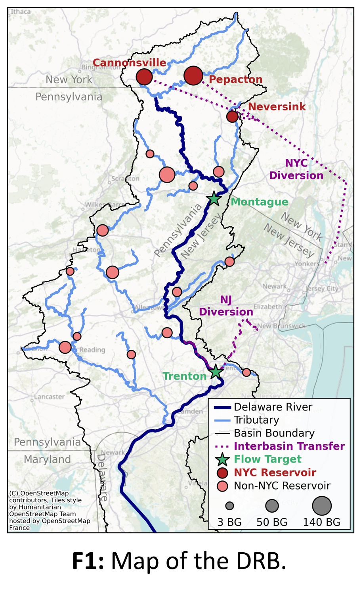
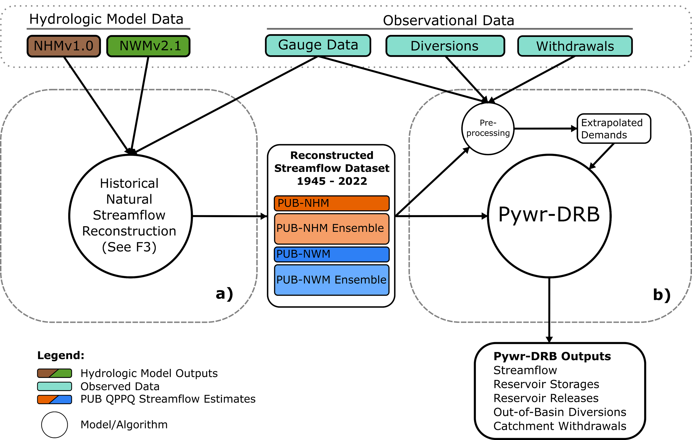
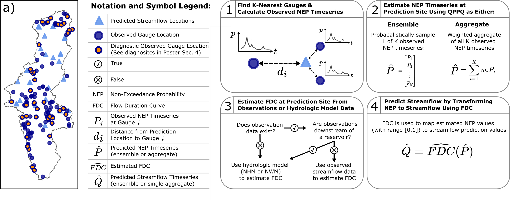
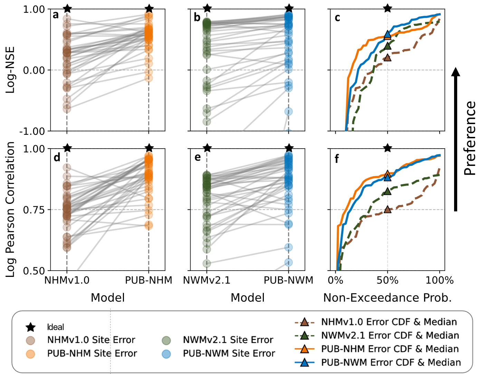
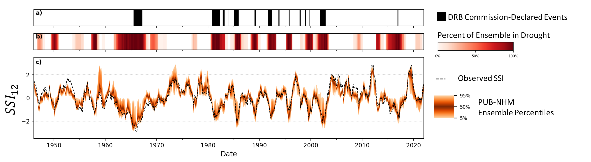
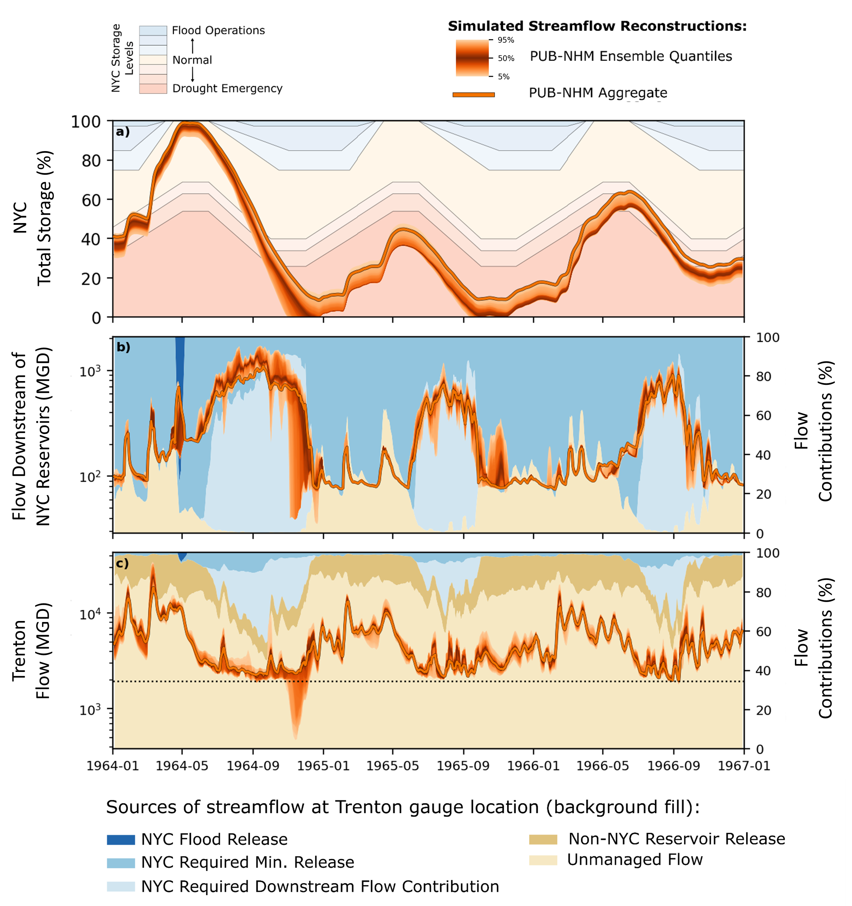

**********************************

## 1| Understanding drought risk in the Delaware River Basin (DRB) requires representation of operations & estimating ungauged streamflows

The DRB is heavily managed, including:
- 17+ reservoirs 
- Up to 800MGD transferred to New York City (NYC)
- Sustains >13.3M people across 4 states

The 2017 Flexible Flow Management Program (FFMP) regulates reservoir operations at NYC and lower basin reservoirs to meet downstream minimum flow targets. 

Pywr-DRB is an open-source model for simulating impacts of management on natural streamflows.

Existing process-based hydrologic model datasets
such as the National Hydrologic Model (NHMv1.0) and the National Water Model (NWMv2.1) have limited time horizons (1983 onward) and do not contain the 1960s drought of record.

Lack of observation gauges in headwater catchments is a challenge  for 
water availability assessment.

## 2 | Reconstructed streamflow as input to a water management model allows for evaluation of modern operations during historical droughts

**F2:** High-level summary of methods. **(a)** Multiple datasets are combined to generate four alternative historical streamflow reconstructions. **(b)** These are then used as inputs for Pywr-DRB which simulates management operations.

## 3 | Streamflows are generated using observed & hydrologic model data with QPPQ prediction in ungauged basin (PUB) methods

**F3:** Graphical overview of methods.  **(a)** Spatial distribution of Pywr-DRB input streamflow prediction locations (triangles), USGS gauges, and validation sites which have observations, NHM, and NWM data. **(1-4)** Summary of the QPPQ prediction in ungauged basins (PUB) method. 

## 4 | PUB-based streamflow estimates outperform NHM & NWM at validation sites, and capture the severe 1960s drought of record

**F4:** Comparison of PUB reconstruction and NHM/NWM errors across 44 validation gauges 
for common 1983-2016 period. **(a,b,d,e)** Site-specific error values for alternative dataset (points), sloped line shows the change between NHM/NWM modeled and PUB-estimated flows. **(c,f)** Cumulative distribution across sites (lines) and median error (triangle) for each dataset.

**F5:** Standardized streamflow index (SSI) was used to identify droughts within the reconstruction ensemble and the observed flows at Trenton.  Streamflow was aggregated to monthly total flow, then rolling 12-month cumulative flow was transformed to a standardized value **(c)** using fitted gamma distributions. **(b)** The percentage of reconstruction ensemble members in drought determined as any continuous period with SSI-12 < 0 and at least one instance of SSI-12 < -1. **(a)** Record of DRB Commission-declared drought events. 

## 5 | Policy-specified minimum flow requirements lead to severe drawdown of NYC water storage under 1960's drought conditions 

**F6:** Simulated dynamics during 1960s drought. **(a)** NYC reservoir combined storage (orange) and operational storage classifications (filled background). **(b)** Total NYC reservoir releases (orange) and simulated release contribution components for the single PUB-NHM streamflow timeseries (filled background). **(c)** Total flow at Trenton gauge location (orange) and flow contributions from alternative sources (filled background).

## Key Take-Aways:

1. QPPQ flow prediction that leverages limited observation data & NHM/NWM datasets improve historical streamflow estimates in the DRB and can extend record to capture the 1960s drought of record.

2. NYC reservoirs, when current management policies are enforced, can contribute a significant portion (~50%) of total flow at downstream locations during drought like the 1960s, but drive NYC supply shortage under these conditions. 

3. Representation of water management policy and infrastructure is necessary to understanding drought risks and vulnerability in institutionally complex river basins.
